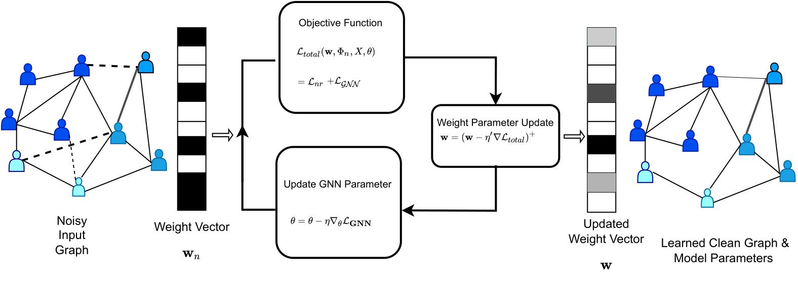

<h1 align="center">RWL-GNN: Robustifying Graph Neural Networks via Weighted Laplacian </h1>
<p align="center"> <a href="https://bharat-runwal.github.io/" target="_blank id="website">Bharat Runwal</a><sup>1</sup>, Vivek<sup>2</sup>, <a href="https://sites.google.com/view/sandeepkr/home" target="_blank id="website">Sandeep Kumar</a><sup>1</sup></p>
<p align="center"><sup>1</sup> IIT Delhi,<sup>2</sup> Samsung Research Bangalore</p>

<p align="center">
  <a href="https://arxiv.org/pdf/2208.01853.pdf" alt="ArXiv">
        </a>
  <a href="https://colab.research.google.com/github/Bharat-Runwal/RWL-GNN/blob/main/Demo_RWL_GNN.ipynb" alt="Demo">
        </a>
  <a href="https://docs.google.com/presentation/d/1qDS09BlPXeO1VtDIVmji1r8ZzpUY4NmujLRa6Aw9QiQ/edit?usp=sharing" alt="Slides">
        </a>
</p>

<p align="center">
  
</p>


A PyTorch implementation of "Robustifying Graph Neural Networks via Weighted Laplacian" Accepted at [SPCOM](https://ece.iisc.ac.in/~spcom/2022/) 2022 (**Best Student Paper Award**).
<!-- 
[![][colab]][RWL-GNN]
<div align=center></div> -->

## Abstract 
- Graph neural network (GNN) is achieving remarkable performances in a variety of
application domains. However, GNN is vulnerable to noise and adversarial attacks
in input data. Making GNN robust against noises and adversarial attacks is an
important problem. The existing defense methods for GNNs are computationally
demanding, are not scalable, and are architecture dependent. In this paper, we
propose a generic framework for robustifying GNN known as Weighted Laplacian
GNN (RWL-GNN). The method combines Weighted Graph Laplacian learning
with the GNN implementation. The proposed method benefits from the positive
semi-definiteness property of Laplacian matrix, feature smoothness, and latent
features via formulating a unified optimization framework, which ensures the ad-
versarial/noisy edges are discarded and connections in the graph are appropriately
weighted. For demonstration, the experiments are conducted with Graph convo-
lutional neural network(GCNN) architecture, however, the proposed framework
is easily amenable to any existing GNN architecture. The simulation results with
benchmark dataset establish the efficacy of the proposed method over the state-
of-the-art methods, both in accuracy and computational efficiency. 

## Requirements
See that in https://github.com/DSE-MSU/DeepRobust/blob/master/requirements.txt

## Installation
To run the code, first you need to install DeepRobust:
```
pip install deeprobust
```
Or you can clone it and install from source code:
```
git clone https://github.com/DSE-MSU/DeepRobust.git
cd DeepRobust
python setup.py install
```

## Run the code
After installation, you can clone this repository or you can use the demo notebook here [COLAB](https://colab.research.google.com/github/Bharat-Runwal/RWL-GNN/blob/main/Demo_RWL_GNN.ipynb)
```
git clone https://github.com/Bharat-Runwal/RWL-GNN.git
cd RWL-GNN
python train.py --two_stage y --seed 10  --dataset cora --attack no --ptb_rate 0 --epochs 200  --epochs_pre 400 --alpha 1.0  --gamma 1.0 --beta 0.10 --lr_optim 1e-2 --lr 1e-3 
```
<!-- [colab]: <https://colab.research.google.com/assets/colab-badge.svg>
[RWL-GNN]: <https://colab.research.google.com/github/Bharat-Runwal/RWL-GNN/blob/main/Demo_RWL_GNN.ipynb> -->

## Acknowledgements
The code is based on :
- DeepRobust [(https://github.com/DSE-MSU/DeepRobust)](https://github.com/DSE-MSU/DeepRobust)
- [Pro-GNN](https://github.com/ChandlerBang/Pro-GNN)

## Cite:

```
@article{runwal2022robust,
  title={Robust Graph Neural Networks using Weighted Graph Laplacian},
  author={Runwal, Bharat and Kumar, Sandeep and others},
  journal={arXiv preprint arXiv:2208.01853},
  year={2022}
}
```
